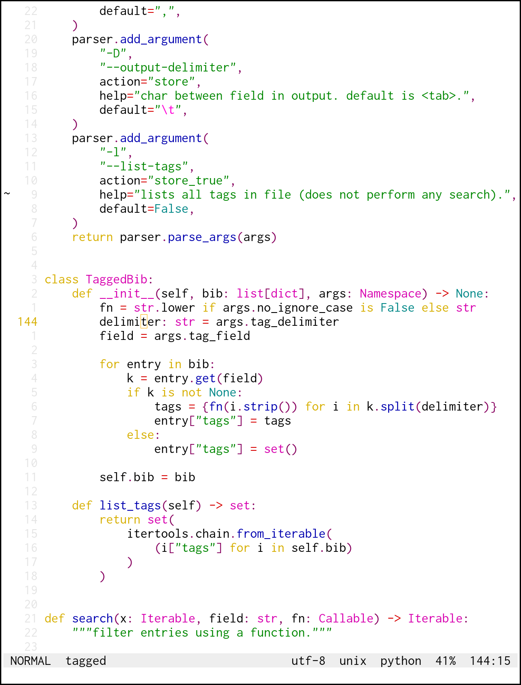
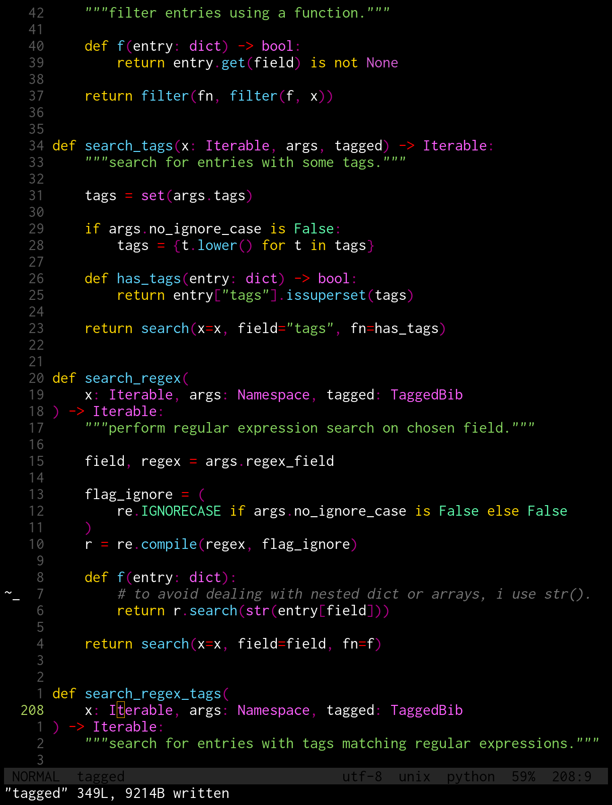

zebulon
=======

neovim colorscheme with very limited palette.




colors
------

9 colors for syntax highlighting:

```lua
Identifier = black
Function   = blue
Statement  = yellow
Operator   = red
String     = green
Constant   = turquoise
Type       = magenta
Special    = pink
Comment    = grey (italic)
```

interface colors are even simplier: everything in greys, except cursor (yellow) and parentheses matching (pink).
